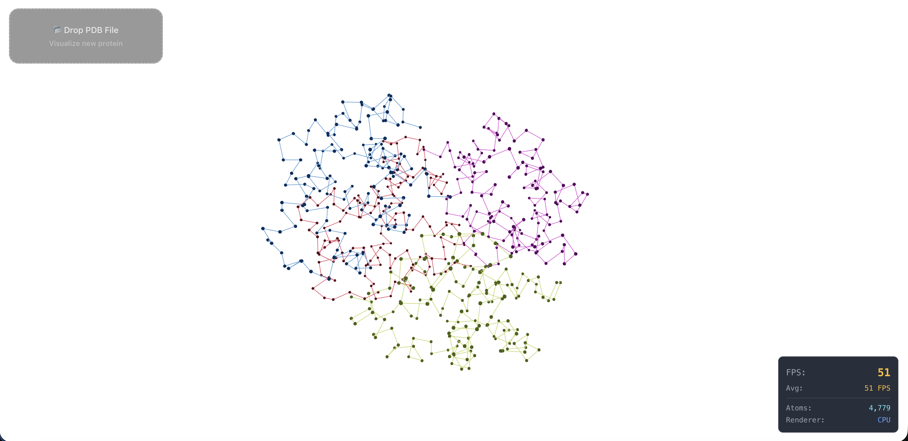
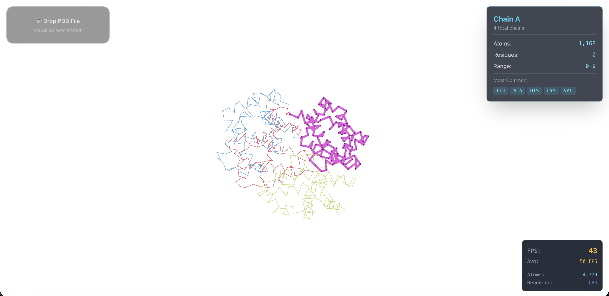
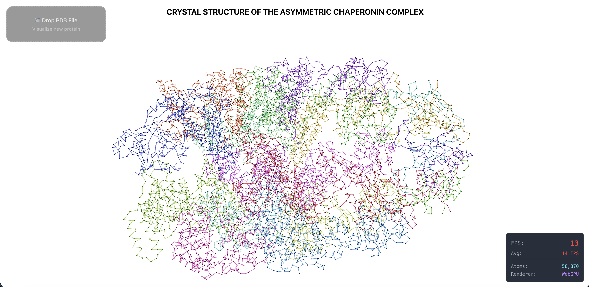
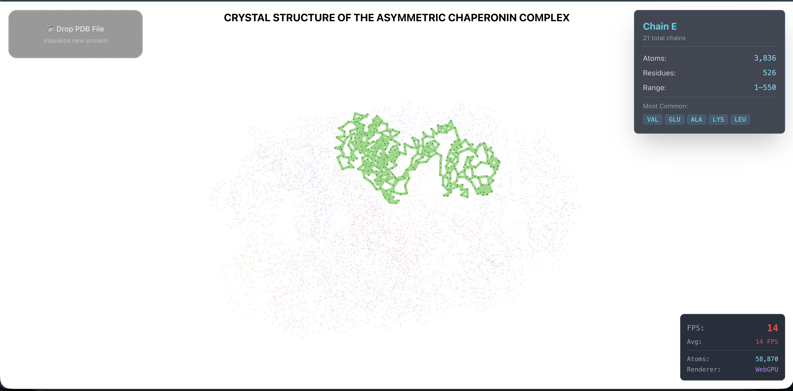

# Molecular Dynamics Visualization UI

An interactive 3D molecular dynamics visualization platform built with React, Three.js, and WebGPU for high-performance rendering of large protein structures.

## 🚀 Features

- **Interactive 3D Visualization**: Real-time molecular structure rendering with orbit controls
- **WebGPU Acceleration**: GPU-powered rendering for large protein structures (10k+ atoms)
- **Performance Monitoring**: Built-in FPS counter to track rendering performance
- **Chain Selection**: Interactive chain highlighting and information display
- **PDB Support**: Load and visualize PDB format molecular structures
- **Trajectory Playback**: Animate molecular dynamics simulation trajectories

## 📸 Screenshots

<table>
  <tr>
    <td width="50%">
      
    </td>
    <td width="50%">
      
    </td>
  </tr>
  <tr>
    <td width="50%">
      
    </td>
    <td width="50%">
      
    </td>
  </tr>
</table>

## 🛠️ Tech Stack

- **React** - UI framework
- **TypeScript** - Type-safe development
- **Three.js / React Three Fiber** - 3D rendering
- **WebGPU** - GPU-accelerated compute and rendering
- **React Three Drei** - Helpful Three.js utilities

## 📋 Prerequisites

- Node.js (v14 or higher)
- npm or yarn
- WebGPU-compatible browser (Chrome 113+, Edge 113+)

## 🎮 Usage

1. **Load a Structure**: Upload a PDB file or use the included example (trajectory.json)
2. **Navigate**: Use mouse to rotate (left-click drag), pan (right-click drag), and zoom (scroll)
3. **Select Chains**: Click on molecular chains to highlight and view detailed information
4. **Monitor Performance**: Check the FPS counter in the top-right for rendering performance

## 🔧 Configuration

The application automatically detects WebGPU support and falls back to WebGL for systems without WebGPU:
- **WebGPU Mode**: Used for structures with 10,000+ atoms
- **WebGL Mode**: Used for smaller structures or WebGPU-incompatible browsers

## 📝 Project Structure

```
md-ui/
├── src/
│   ├── components/         # React components
│   │   ├── MolecularView.tsx
│   │   ├── BackboneView.tsx
│   │   ├── GPUAtomRenderer.tsx
│   │   └── FPSCounter.tsx
│   ├── gpu/               # WebGPU context and shaders
│   │   ├── WebGpuContext.ts
│   │   ├── computePipeline.ts
│   │   └── shaders/
│   ├── types/             # TypeScript type definitions
│   └── pages/             # Page components
├── images/                # Screenshots and assets
└── public/                # Static files
```

## 🤝 Contributing

Contributions are welcome! Please feel free to submit a Pull Request.

## 📄 License

This project is open source and available under the MIT License.

## 🔗 Resources

- [WebGPU Documentation](https://www.w3.org/TR/webgpu/)
- [Three.js Docs](https://threejs.org/docs/)
- [React Three Fiber](https://docs.pmnd.rs/react-three-fiber/)
